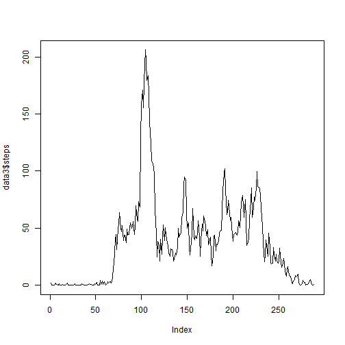

### Loading data and opening packages


```r
setwd("~/R/Cousera R/data/repdata_data_activity_Repro_project1")
data <- read.csv("activity.csv")
```

Open packages


```r
      library("ggplot2")
      library("plyr")
```

### What is mean total number of steps taken per day?

1. Make a histogram of the total number of steps taken each day

```r
      data2 <- aggregate(steps ~ date, data, sum)
      qplot(steps, data=data2, binwidth=500)
```

 

2. Mean and median total number of steps taken per day 

```r
      s<- summary(data2$steps)
      c(s[4],s[3])
```

```
##   Mean Median 
##  10770  10760
```

### What is the average daily activity pattern?

1. Time series plot of 5min interval and the average number of steps taken 

```r
      data3 <- aggregate(steps ~ interval, data, mean)
      plot(data3$steps, type="l")
```

 

2. Find the maximum number of steps

```r
      mx <- max(data3$steps)
      index <- data3$steps == mx
      i <- data3[index,]
```
The interval, contains the maximum number of steps is:

```r
      i[[1]]
```

```
## [1] 835
```

### Imputing missing values

1. Total number of rows with missing values in the datasets is:

```r
     length(which(is.na(data)))
```

```
## [1] 2304
```

3. Cerate a new dataset that is equal to the original dataset but with the missing data filled in

```r
      datajoin <- join(x=data, y=data3, by = "interval")
      datajoin[which(is.na(data)),1] <- datajoin[which(is.na(data)),4]
      data4 <- datajoin[1:3]
```

4. Make a histogram of the total number of steps taken each day

```r
      data5 <- aggregate(steps ~ date, data4, sum)
      qplot(steps, data=data2, binwidth=500)
```

 

4. Mean and median total number of steps taken per day 

```r
      su<- summary(data5$steps)
      c(su[4],su[3])
```

```
##   Mean Median 
##  10770  10770
```
There was small impact on the median, but no impact on the mean.

### Are there differences in activity patterns between weekdays and weekends?


```r
      data4$weekday <- weekdays(as.Date(data4$date))
      wkend <- (data4[(grepl("Saturday",data4$weekday) | grepl("Sunday",data4$weekday)) == TRUE,])
      wkday <- (data4[!(grepl("Saturday",data4$weekday) | grepl("Sunday",data4$weekday)) == TRUE,])
      weekend <- aggregate(steps ~ interval, wkend, mean)
      weekday <- aggregate(steps ~ interval, wkday, mean)
      weekend$day <- "weekend"
      weekday$day <- "weekday"
      d <- rbind(weekend, weekday)
      ggplot(d, aes(x=interval, y=steps)) + geom_line() + facet_grid(. ~ day)
```

 


